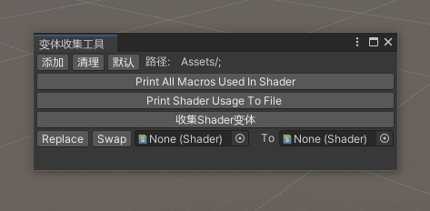

##Unity Shader 变体收集工具
收集指定路径下的材质球用到的shader变体生成shadervariants文件，附一键替换shader等小功能

 

- Print All Macros Used In Shader：打印全部shader关键字
- Print Shader Usage To File： 收集材质球的shader使用情况，log位置：Assets/ShaderUsage.csv
- 收集Shader变体： 收集指定路径中的材质球使用到的shader并生成shadervariants文件
- Replace：将路径中所有材质球上的旧shader替换为新shader

####使用方式

- ShaderVariantsCollectionWindow.cs 脚本置于Editor目录
- 菜单 Graphic/ShaderVariantsCollection打开窗口

####注意事项
- shadervariants仅控制 shader_feature 类关键字，multi_compile类关键字无论是否收集都会进包
- 工具仅收集材质球用到的关键字。若有关键字无材质球使用又想进包，可使用DummyMaterial（启用关键字供收集但不打包，可单独拿一个文件夹存放）